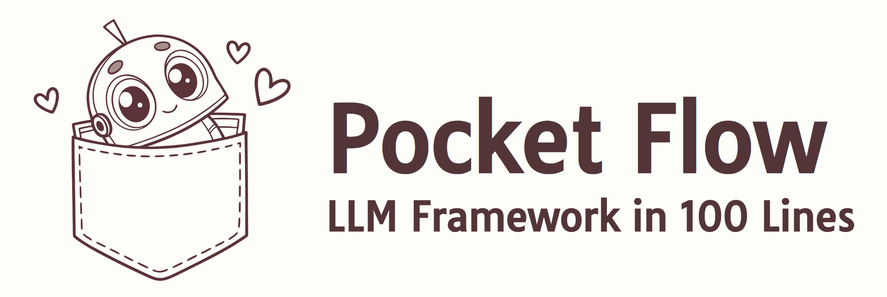
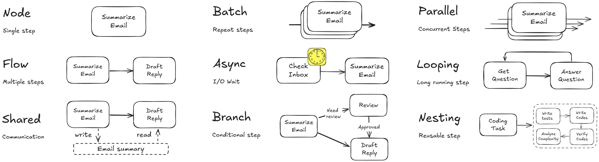
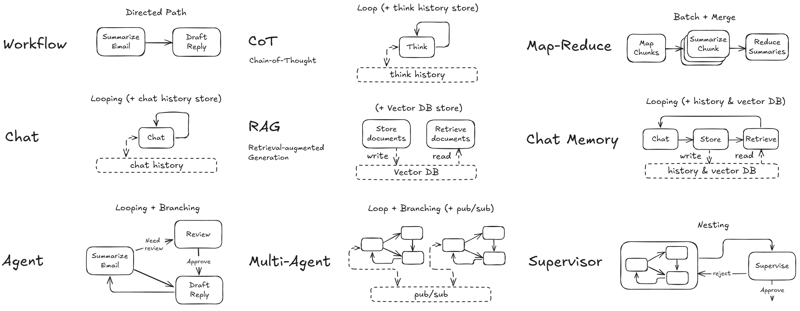

<div align="center">
  
  <br>
  <strong style="font-size:2em">Code for <em>The 100-Line LLM Framework</em></strong>
  <br>
  <a href="./.github/workflows/examples.yml"></a>
  <a href="./pocketflow/__init__.py"></a>
  <a href="./LICENSE"></a>
</div>

Every AI product you have used is simpler than it looks. A chatbot is one node that calls the model and loops back every time you hit send. RAG is five nodes in a line: chunk, embed, store, retrieve, generate. A coding agent is that same loop with one branch, where the code either runs or you try again. Deep research is that branch nested inside itself. Frameworks bury that shape under a hundred thousand lines of their own code, so this book goes the other way. It takes a product that looks like magic, strips the abstractions off until only the graph is left, and rebuilds it from scratch in code you can read in one sitting. By the end you will have built a chatbot, a RAG pipeline, a research agent, and a coding agent, all of them running on the same 100 lines.

Every program is here, one folder per chapter, and none of it is pseudocode. It all runs on [PocketFlow](https://github.com/The-Pocket/PocketFlow), which is 100 lines of Python with no dependencies. You can read the whole file in an afternoon and paste it into your own repo.

---

## Quickstart

```bash
git clone https://github.com/zachary62/100-line-llm-framework
cd 100-line-llm-framework
pip install -r requirements.txt

export GEMINI_API_KEY="your-key"
python ch02-graph/chatbot.py         # a working chatbot, 30 lines
python ch03-patterns/agent.py        # a ReAct agent that searches the web
```

Vendor code lives in `call_llm.py`, about ten lines of it. Gemini runs by default, and OpenAI, Anthropic, and local Ollama sit commented out in the same file. Models are named by role, so `export FAST_MODEL=...` swaps one without touching any example.

---

## What is in each chapter folder

| Chapter | Folder | What you will run |
|---|---|---|
| 2. The graph | [`ch02-graph/`](./ch02-graph) | The node's three steps, the four flow operations, a 30-line chatbot, retries, YAML output, batch, async |
| 3. Workflow, agent, and more | [`ch03-patterns/`](./ch03-patterns) | Workflow, ReAct agent, guardrail, judge, majority vote, debate, chain of thought, self-healing code, heartbeat |
| 4. RAG | [`ch04-rag/`](./ch04-rag) | The pipeline on word overlap, then on real embeddings, plus an agentic RAG loop |
| 5. Deep research | [`ch05-deep-research/`](./ch05-deep-research) | Planner → Researcher → Synthesizer, looping until the report is done |
| 6. Workflow products | [`ch06-workflow-products/`](./ch06-workflow-products) | A NotebookLM clone, text-to-SQL with a debug loop, lead generation, invoice extraction, a newsletter |
| 7. Prompt engineering | [`ch07-prompt-engineering/`](./ch07-prompt-engineering) | The same prompt in three versions, and what domain knowledge does to the output |
| 10. Coding agent | [`ch10-coding-agent/`](./ch10-coding-agent) | Four coding agents, from a naive three-tool loop to edit-by-diff with safety rails |

---

## The three ideas

- **Node** — one unit of work, with three steps: `prep` reads from the shared store, `exec` does the work, `post` writes results back and returns an action string.
- **Flow** — how nodes connect: chain, branch, loop, nest. A Flow is itself a Node, which is why an entire agent can sit in one slot of a bigger graph.
- **Shared store** — a Python dict. Print it at any moment and you see your whole application's state.

<div align="center">
  
</div>

Every pattern in the book is those three ideas wired differently: a chatbot is a loop, RAG is a chain, and an agent is a loop with a branch.

The same graph ships inside every major framework, pinned here by commit so the lines hold:
[OpenAI Agents SDK](https://github.com/openai/openai-agents-python/blob/48ff99bb736249e99251eb2c7ecf00237488c17a/src/agents/run.py#L119) ·
[Pydantic AI](https://github.com/pydantic/pydantic-ai/blob/4c0f384a0626299382c22a8e3372638885e18286/pydantic_ai_slim/pydantic_ai/_agent_graph.py#L779) ·
[LangChain 1.2.14](https://github.com/langchain-ai/langchain/blob/90087ce6bf/libs/langchain/langchain_classic/agents/agent_iterator.py#L173) ·
[LangGraph 1.1.4](https://github.com/langchain-ai/langgraph/blob/5c9c1d59/libs/prebuilt/langgraph/prebuilt/chat_agent_executor.py#L789)

<div align="center">
  
</div>
