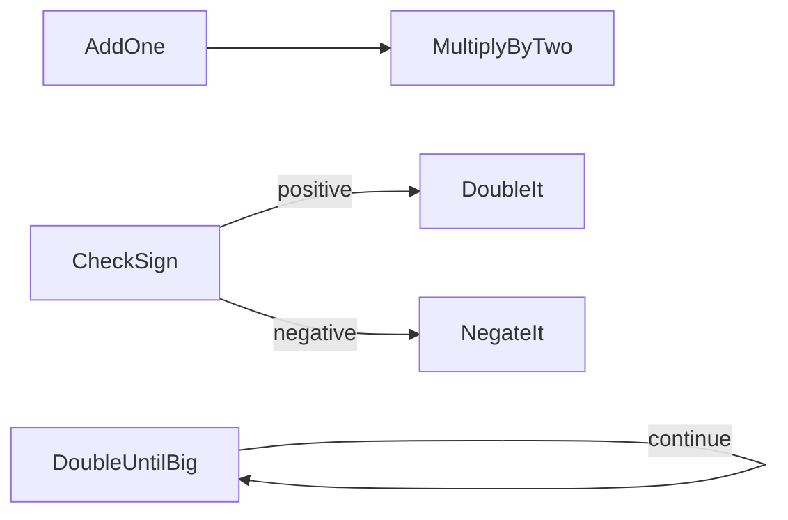
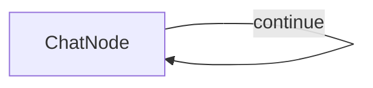

# Chapter 2: The Graph

- `add_one.py` — Section 2.1: Node and Shared Store (prep/exec/post basics)
- `flow_examples.py` — Section 2.2: Flow (chain, branch, loop, nest)
- `call_llm.py` (shared at `codes/call_llm.py`) — Section 2.3: Calling LLMs (10 line wrapper)
- `chatbot.py` — Section 2.4: Chatbot in 30 Lines (self loop + conversation memory)
- `unreliable_add_one.py` — Section 2.5: Retries and Fallbacks (max_retries, exec_fallback)
- `structured_output.py` — Section 2.6: Structured Output (YAML + validation + retries)
- `batch.py` — Section 2.7: Batch (BatchNode for independent items)
- `async_parallel.py` — Section 2.8: Async and Parallel (AsyncParallelBatchNode)

## Flows

### flow_examples.py


### chatbot.py


## Sample Outputs

### add_one.py
```
6
```

### flow_examples.py
```
Chain: 5 -> +1 -> *2 = 12
Branch (positive): 3 -> 6
Branch (negative): -3 -> 3
Loop: 1 -> double until >10 = 16
Nest: 5 -> (+1 -> +1) -> *2 = 14
```

### unreliable_add_one.py
```
  Failed! Retrying...
  Failed! Retrying...
  Success!
Result: 6
```

### structured_output.py
```
{'name': 'John Smith', 'email': 'john@example.com', 'skills': ['Python', 'FastAPI', 'PostgreSQL', 'Docker', 'AWS']}
```

### batch.py
```
Review 1: The food was amazing, though the service was slow.
Review 2: Hailed as the best pizza in town for its crispy crust and fresh ingredients, the reviewer will definitely come back.
Review 3: Tiny portions of bland pasta make this meal overpriced.
```

### async_parallel.py
```
Parallel took 4.4s
Review 1: The food was amazing, but the service was slow, with appetizers taking 30 minutes to arrive.
Review 2: The best pizza in town boasts a crispy crust and fresh ingredients, guaranteeing a return visit.
Review 3: The meal was overpriced, offering bland pasta in tiny portions.
```
