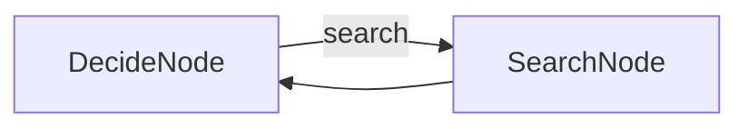
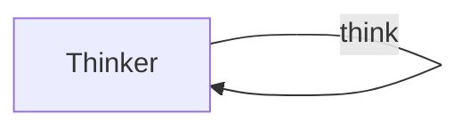

# Chapter 3: Workflow, Agent, and More

- `workflow.py` — Section 3.1: Task Decomposition (Extract → Hook → Tweet chain)
- `agent.py` — Section 3.2: ReAct Agent (Decide → Search → Answer loop)
- `guardrail.py` — Section 3.3: Guardrail (Write → Review → Approve/Reject gate)
- `judge.py` — Section 3.4: LLM as Judge (Generate → Judge → Retry loop)
- `vote.py` — Section 3.4: Majority Vote (5 calls, pick consensus)
- `debate.py` — Section 3.4: Debate (Advocate For → Advocate Against → Judge)
- `chain_of_thought.py` — Section 3.5: Chain of Thought (step-by-step reasoning loop)
- `self_healing.py` — Section 3.5: Self-Healing (Write → Run → Error → Fix loop)
- `heartbeat.py` — Section 3.6: Heartbeat (Wait → Check → Process email loop)

## Flows

### workflow.py


### agent.py


### guardrail.py


### judge.py


### vote.py


### debate.py


### chain_of_thought.py


### self_healing.py


### heartbeat.py


## Sample Outputs

### workflow.py
```
Facts:
1. Octopuses can solve puzzles faster than most primates.
2. Octopuses completed mazes in under 30 seconds, while chimpanzees averaged 2 minutes.
3. Their distributed neural networks (neurons in their arms) may be more efficient for spatial tasks.

Hook: Think chimpanzees are the ultimate problem-solvers? In mazes, octopuses dominate,
completing them in under 30 seconds while chimps average two minutes.

Tweet: Think chimpanzees are the ultimate problem-solvers? Octopuses complete mazes in
under 30 seconds while chimps average two minutes. 🐙 #AnimalIntelligence
```

### agent.py
```
(pending re-record: this file was rebuilt to match the chapter listings exactly, so its recorded output lands with the next live run)
```

### guardrail.py
```
(pending re-record: this file was rebuilt to match the chapter listings exactly, so its recorded output lands with the next live run)
```

### judge.py
```
--- Draft ---
Escape the chaos and immerse yourself in pure sound with our advanced
noise-canceling headphones...

Judge: PASS
```

### vote.py
```
Vote 1: negative — Despite excellent food, multiple severe service failures made the overall experience problematic.
Vote 2: negative — Numerous service issues led the reviewer to feel ambivalent.
Vote 3: negative — Despite excellent food, service failures create a frustrating experience.
Vote 4: negative — Service and billing issues severely detract from the overall dining experience.
Vote 5: negative — Multiple poor service issues led to indecision rather than satisfaction.
Consensus: negative
```

### debate.py
```
--- FOR ---
Rewriting in Rust would deliver significantly improved performance and memory safety...

--- AGAINST ---
A full rewrite incurs immense development costs, potential for new bugs, and delays...

--- VERDICT ---
The AGAINST argument is stronger — practical costs and risks outweigh theoretical gains.
```

### chain_of_thought.py
```
Step 1: I need to use the Principle of Inclusion-Exclusion for three sets.
Step 2: Sum individual sets: 1,200 + 800 + 500 = 2,500.
Step 3: Sum pairwise intersections: 400 + 200 + 150 = 750.
Step 4: Apply inclusion-exclusion: 2,500 - 750 = 1,750.
Step 5: Add back triple overlap: 1,750 + 100 = 1,850 engaged users.
Answer: 150

Final answer: 150
```

### self_healing.py
```
--- Code ---
def print_first_10_fibonacci():
    a, b = 0, 1
    for _ in range(10):
        print(a)
        a, b = b, a + b

print_first_10_fibonacci()

Success!
```

### heartbeat.py
```
--- Heartbeat 1 ---
Sleeping 2s...
No new emails.

--- Heartbeat 2 ---
Sleeping 2s...
1 new email(s)!
-> Your boss requires the Q3 numbers by Friday and requests confirmation.
   Reply: "Confirmed, I will provide the Q3 numbers by Friday."

--- Heartbeat 3 ---
Sleeping 2s...
No new emails.

--- Heartbeat 4 ---
Sleeping 2s...
1 new email(s)!
-> Client states Invoice #1042 has incorrect amount ($5,400 vs $4,500).
   Reply: Investigate and issue a revised invoice.

Total emails processed: 2
```
