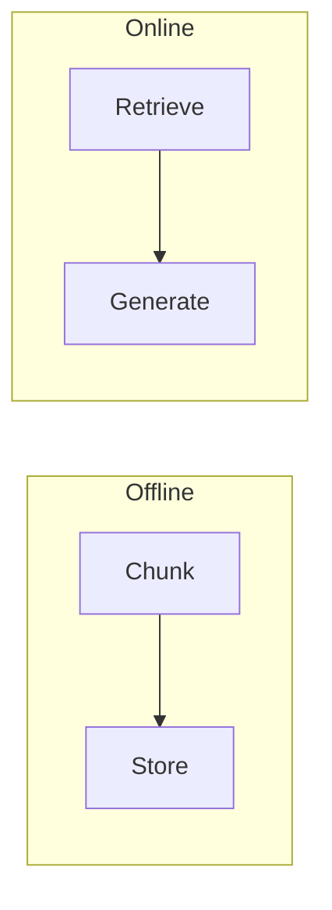
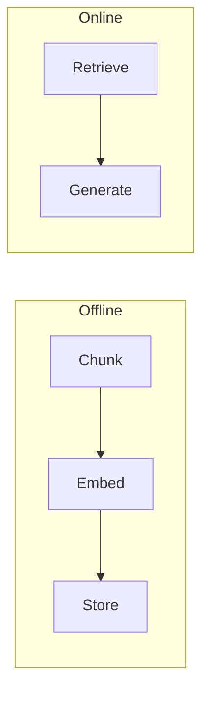
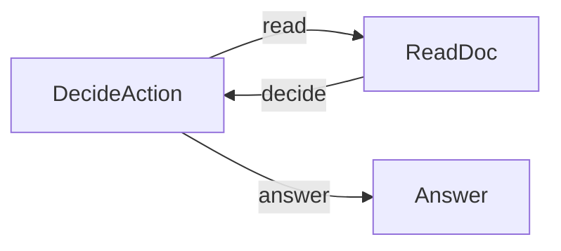

# Chapter 4: RAG

- `rag_pipeline.py` — Section 4.3: the full pipeline with word overlap instead of embeddings, so it runs with no embedding API at all (listings 4.2-4.7)
- `embeddings.py` — Section 4.4: embeddings and cosine similarity on their own (listing 4.8)
- `rag_embeddings.py` — Section 4.4: the same pipeline with real embeddings, one new node and one changed line (listings 4.8-4.9)
- `agentic_rag.py` — Section 4.5: Agentic RAG (agent reads doc summaries, decides what to dive into)

## Flows

### rag_pipeline.py


### rag_embeddings.py


### agentic_rag.py


## Sample Outputs

### embeddings.py
```
  0.773  |  'The dog barked loudly'  vs  'The puppy made noise'
  0.708  |  'The dog barked loudly'  vs  'The cat meowed softly'
  0.554  |  'The dog barked loudly'  vs  'Stock market crashed today'
```

### rag_pipeline.py
```
(pending re-record: this file was rebuilt to match the chapter listings exactly, so its recorded output lands with the next live run)
```

### rag_embeddings.py
```
(pending re-record: split out from the old combined pipeline, so its recorded output lands with the next live run)
```

### agentic_rag.py
```
  Agent: reading 'nodes'

Q: How does PocketFlow handle retries in nodes?
A: PocketFlow handles retries by only retrying the exec phase if it fails.
The prep and post phases do not retry.
```
