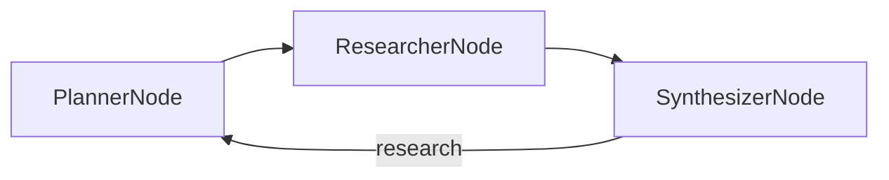

# Chapter 5: Deep Research

The Deep Research pipeline (Planner → Researcher → Synthesizer loop, sections 5.1-5.4) in the standard PocketFlow project layout: `main.py` (entry point and shared store), `flow.py` (wiring), `nodes.py` (the three nodes), and the high-level design in [docs/design.md](docs/design.md).

Shared utility (at the repo root):
- `search_web.py` — level 3 of the three search depths in section 5.2: DuckDuckGo for the URLs, then Jina Reader to crawl each page so the model reads full articles instead of snippets. Listings 5.2 and 5.3 show the two shallower options (raw snippets, and Gemini's Google Search grounding); swap either one in and nothing else changes, because the signature stays `search_web(query) -> str`.

## Flow



## Sample Output

```
Researching: PocketFlow, the 100-line minimalist LLM framework

  Planner: ['PocketFlow LLM framework GitHub', 'PocketFlow minimalist LLM framework 100 lines of code', 'how to use PocketFlow for LLM orchestration']
  Synthesizer: done

--- Report ---
# PocketFlow: The 100-Line Minimalist LLM Framework — Comprehensive Research Report

## 1. Executive Summary & Core Definition
PocketFlow is an ultra-lightweight, minimalist LLM orchestration framework
designed around a **directed graph architecture**. True to its name, the core
Python implementation spans roughly 100 lines of code, prioritizing absolute
transparency, zero bloat, and zero vendor lock-in.
[...]
```
