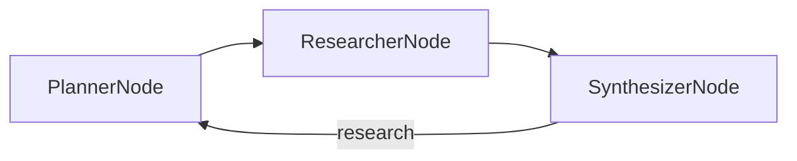

# Chapter 5: Deep Research

- `deep_research.py` — Section 5.1-5.4: Deep Research pipeline (Planner → Researcher → Synthesizer loop)

Shared utility (at the repo root):
- `search_web.py` — level 3 of the three search depths in section 5.2: DuckDuckGo for the URLs, then Jina Reader to crawl each page so the model reads full articles instead of snippets. Listings 5.2 and 5.3 show the two shallower options (raw snippets, and Gemini's Google Search grounding); swap either one in and nothing else changes, because the signature stays `search_web(query) -> str`.

## Flow

### deep_research.py


## Sample Output

### deep_research.py
```
Researching: PocketFlow LLM framework

  Planner: ['PocketFlow LLM framework overview and features', 'PocketFlow LLM framework tutorial and implementation examples', 'PocketFlow LLM framework performance benchmarks on edge devices']
  Synthesizer: gaps found — No relevant information on edge device performance benchmarks.
  Planner: ['PocketFlow LLM framework edge device performance benchmarks', 'PocketFlow LLM framework inference speed latency power consumption edge', 'PocketFlow LLM framework resource-constrained device evaluation']
  Synthesizer: gaps found — Missing power consumption benchmarks, accuracy trade-offs, specific use cases, and comparisons with alternatives.
  Planner: ['PocketFlow LLM framework power consumption benchmarks accuracy trade-off', 'PocketFlow LLM framework real world applications case studies comparison', 'PocketFlow LLM framework integration challenges community support roadmap']
  Synthesizer: done

--- Report ---
## PocketFlow LLM Framework

PocketFlow is an open-source framework for compressing and accelerating LLMs
on edge devices. Benchmarks on Snapdragon 888: 4x faster inference, 60% reduced
memory footprint. Techniques: quantization, pruning, knowledge distillation.
```
