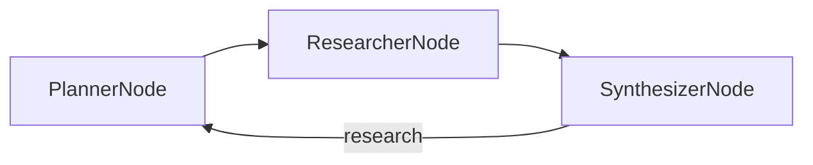

# Design Doc: Deep Research

> Please DON'T remove notes for AI

## Requirements

> Notes for AI: Keep it simple and clear.
> If the requirements are abstract, write concrete user stories

Given a topic, return a research report with citations from the live web — not a single search summary. The system should break the topic into specific search angles, read what it finds, notice what's still missing, go back for more, and only then write the report. A round cap keeps it from looping forever, because an LLM can always think of one more gap.

## Flow Design

> Notes for AI:
> 1. Consider the design patterns of agent, map-reduce, rag, and workflow. Apply them if they fit.
> 2. Present a concise, high-level description of the workflow.

### Applicable Design Pattern:

**Map-reduce inside a reflection loop.** The Planner maps one topic into parallel search queries; the Researcher executes them; the Synthesizer reduces the notes and decides: finalize, or name the gaps and loop back to the Planner.

### Flow high-level Design:

1. **PlannerNode**: Turns the topic (plus any gap feedback) into 3 specific search queries.
2. **ResearcherNode**: For each query, searches the web and distills the raw results into citable facts. A BatchNode — one exec per query.
3. **SynthesizerNode**: Reads all notes and either writes the report ("finalize") or names what's missing and returns "research" to loop. After 2 loops it must finalize.



## Utility Functions

> Notes for AI:
> 1. Understand the utility function definition thoroughly by reviewing the doc.
> 2. Include only the necessary utility functions, based on nodes in the flow.

1. **Call LLM** (`call_llm.py` at the repo root)
   - *Input*: prompt (str)
   - *Output*: response (str)
   - Used by all three nodes.

2. **Web search** (`search_web.py` at the repo root)
   - *Input*: query (str)
   - *Output*: full page text of the top results (str)
   - Used by ResearcherNode. This is level 3 of the chapter's three search depths (full crawl via DuckDuckGo + Jina Reader); the two shallower options swap in without touching any node, because the signature stays `search_web(query) -> str`.

## Node Design

### Shared Store

> Notes for AI: Try to minimize data redundancy

```python
shared = {
    "topic": "...",            # Input
    "current_queries": [],     # PlannerNode output for this round
    "notes": [],               # ResearcherNode output, accumulated across rounds
    "feedback": "...",         # SynthesizerNode's named gaps, read by the next Planner round
    "loop_count": 0,           # rounds so far, capped at 2 extra rounds
    "report": "...",           # final output
}
```

### Node Steps

> Notes for AI: Carefully decide whether to use Batch/Async Node/Flow.

1. **PlannerNode** — Regular. *prep*: read "topic" and "feedback". *exec*: prompt for 3 queries as YAML (gap-targeted when feedback exists). *post*: write "current_queries".
2. **ResearcherNode** — Batch (one `AsyncParallelBatchNode` swap away from truly parallel). *prep*: read "current_queries". *exec* (per query): search, then extract key facts. *post*: extend "notes".
3. **SynthesizerNode** — Regular. *prep*: read topic, notes, loop count. *exec*: past the cap, write the report; otherwise ask whether the notes suffice, returning "research"+feedback or "finalize"+content as YAML. *post*: on "research", bump the counter and store feedback; on "finalize", store the report.
