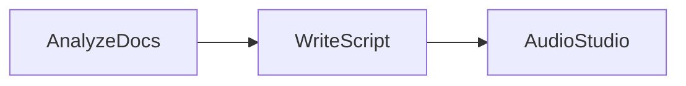
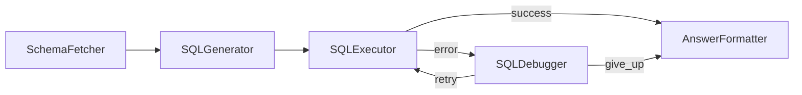
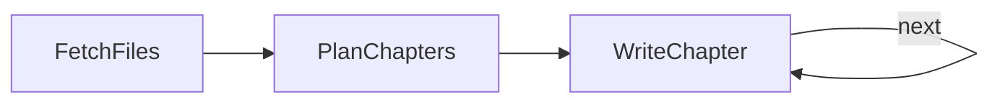
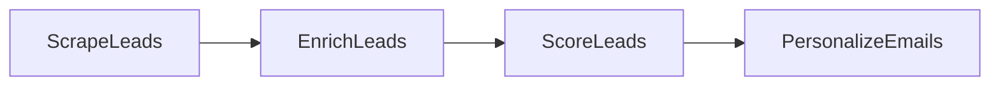

# Chapter 6: Workflow Products

- `notebook_lm.py` — Section 6.1: NotebookLM (Analyze docs → Write script → TTS)
- `text_to_sql.py` — Section 6.2: Text to SQL (Schema → SQL → Execute → Debug loop: three repairs, give-up on the fourth failed run)
- `codebase_knowledge.py` — Section 6.3: Codebase knowledge (Fetch → Plan → Write chapter, looping with carried context)
- `lead_gen.py` — Section 6.4: Lead Gen (Scrape → Enrich → Score → Personalize emails)
- `invoice_processing.py` — Section 6.5: Invoice Processing (PDF → Extract → Validate)
- `create_invoice_pdf.py` — Helper: generates sample invoice.pdf
- `newsletter.py` — Section 6.6: AI Newsletter (Curate → Filter → Summarize → Format)

## Flows

### notebook_lm.py


### text_to_sql.py


### codebase_knowledge.py


### lead_gen.py


### invoice_processing.py


### newsletter.py


## Sample Outputs

### notebook_lm.py
```
  Extracted nuggets from 4 docs
  Audio saved to podcast.wav
--- Podcast Script ---
Alex: Jamie, I just read about this new LLM framework, and honestly, my jaw is on the floor.
      It's built in just 100 lines of code!
Jamie: Wait, seriously? A hundred lines? How can it possibly cover everything?
Alex: That's the claim! Zero dependencies, zero vendor lock-in, captures every LLM design pattern.
Jamie: Okay, that's bold. How does it even work under the hood?
Alex: Strict separation. Each Node has prep, exec, post phases. Only exec retries on failure.
Jamie: That's a smart separation of concerns. And I heard flows themselves are nodes?
Alex: Yup! Nest them infinitely. A payment flow inside an order flow inside a checkout.
Jamie: Wow, that's elegant. And all AI products are just five patterns?
```

### text_to_sql.py
```
Q: How much revenue came from completed orders?
A: The revenue from completed orders was $389.93.

Q: Which customer spent the most?
A: Dave spent the most.
```

### codebase_knowledge.py
```
===== Chapter 1: BaseNode =====
## Chapter 1: BaseNode - The Workflow's First Step

Welcome to the foundation of our workflow system! Every powerful process, no matter how complex, is built from simple, repeatable steps. In our system, these fundamental steps are called **Nodes**, and the blueprint for all of them is the `BaseNode`.

Imagine building something with LEGOs. Before you can construct a grand castle or a spaceship, y ...

===== Chapter 2: _ConditionalTransition =====
## Chapter 2: ConditionalTransition

In Chapter 1, we learned about `BaseNode`, the fundamental building block of our workflow system. We saw how nodes can process data and, optionally, point to a `next_node` to continue the workflow in a simple, linear fashion. But what if your workflow isn't always a straight line? What if your nodes need to make decisions and branch off into different paths bas ...

===== Chapter 3: Node =====
In the previous chapters, we introduced the `BaseNode`, the fundamental building block of our workflow, representing an atomic step, and explored `_ConditionalTransition` for directing workflow paths. While `BaseNode` is great for defining what a step *does*, it has a crucial limitation: what happens if the logic inside its `_run` method encounters an error? Currently, it would simply fail, potent ...

===== Chapter 4: Flow =====
# Chapter 4: Flow

Welcome back! In our previous chapters, we've explored `BaseNode` as the fundamental unit of work, `_ConditionalTransition` as the logic that decides the path forward, and `Node` as a concrete, actionable component. Now, it's time to bring all these pieces together with the **Flow**.

## What is a Flow? The Grand Orchestrator

Imagine you have a complex recipe. You have differen ...

===== Chapter 5: BatchNode =====
## Chapte
[...]
```

### lead_gen.py
```
  Loaded 3 leads
  Enriched 3 leads
  Scores:
    Priya Patel: 9/10 — Just pivoted to LLMs, urgently needs custom framework
    Sarah Chen: 8/10 — CTO of LLM-focused company using Python
    Marcus Johnson: 7/10 — Building AI product but primary stack is TypeScript

--- Priya Patel (score: 9) ---
Subject: PocketFlow for FinBot's LLM Pivot?
Priya, seeing FinBot's recent pivot to an LLM-based approach, you're likely
navigating the complexities of building AI applications quickly...

--- Sarah Chen (score: 8) ---
Subject: Zero-Dependency LLM Dev for DataStack AI
Sarah, given DataStack AI's traction in LLM-powered analytics, I imagine your
team constantly seeks ways to accelerate development...
```

### invoice_processing.py
```
  Extracted 4 line items from PDF
  Validation passed

Invoice: INV-2024-0892
Vendor: TechSupply Co. -> Customer: Acme Analytics
Items: 4
  2x GPU Server (A100 80GB): $24998.00
  4x NVMe SSD 2TB: $1159.96
  2x Server Rack Mount Kit: $149.00
  1x Setup & Configuration: $1500.00
Total: $30240.07 (due April 14, 2024)
```

### newsletter.py
```
  Curated 3 topic searches
  Selected 4 stories
# AI Weekly Digest

## 1. AI Agent Market Explodes Amidst Critical Oversight Challenges
The AI agent market is set to power 40% of enterprise apps by 2026,
but businesses face major risks unless they adopt trust frameworks now.

## 2. LLM Benchmarks: Open-Source Models Closing the Gap
GPT-5 aces a future math competition, but open-source models are hot
on their heels, proving accessible AI is becoming reality.
```
