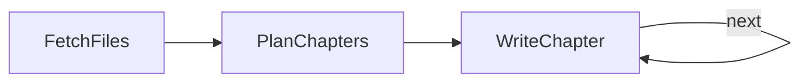

# Codebase knowledge: a loop that carries context forward

Section 6.3. Plans a 10-chapter tutorial for a repo, then writes one chapter per loop iteration — each one seeing everything already written, so later chapters build instead of repeat. Design in [docs/design.md](docs/design.md).



```bash
python main.py                        # documents this repo's pocketflow/ package
REPO_PATH=/path/to/repo python main.py
```

## Sample output

```
===== Chapter 1: BaseNode =====
# Chapter: BaseNode

Welcome to the first chapter of the PocketFlow tutorial! In this chapter, we will
explore **`BaseNode`**, the foundational building block of the entire library.

If PocketFlow is a city, a `BaseNode` is a standard building block—a self-contained
unit of work that knows how to fetch its materials, perform a task, and clean up
or report its results. ...

===== Chapter 3: Node =====
# Chapter: Node

Welcome to the third chapter of the PocketFlow tutorial! In previous chapters, we
learned how to build basic tasks with `BaseNode` and route workflows dynamically
using `_ConditionalTransition`.

However, in the real world, things fail. Network requests timeout, third-party
APIs throw rate-limit errors, and databases temporarily drop connections. ...

[...chapters 4 through 10 follow, each opening by recapping the previous ones...]
```
