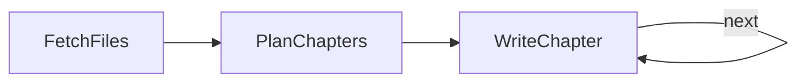

# Codebase knowledge: a loop that carries context forward

Section 6.3. Plans a 10-chapter tutorial for a repo, then writes one chapter per loop iteration — each one seeing everything already written, so later chapters build instead of repeat. Design in [docs/design.md](docs/design.md).



```bash
python main.py                        # documents this repo's pocketflow/ package
REPO_PATH=/path/to/repo python main.py
```

## Sample output

**Read the full result: [sample_output/tutorial.md](sample_output/tutorial.md)** — all 10 chapters (42KB) from a real run over the 100-line `pocketflow/` package. (Your own runs write to `output/tutorial.md`, so the sample stays untouched.) It opens like this:

```
# Chapter 1: BaseNode

Welcome to the first chapter of the PocketFlow tutorial! In this chapter, we
will explore **`BaseNode`**, the foundational unit of execution that powers
everything in PocketFlow.

Whether you are building a simple script or a complex multi-step workflow,
understanding `BaseNode` is essential because every node in PocketFlow
inherits its core behavior from this class.
```

Each later chapter opens by recapping the previous ones — that's the carried context at work. The AsyncFlow chapter starts: "In previous chapters, we learned how to build asynchronous single steps (`AsyncNode`), process batches of items concurrently (`AsyncParallelBatchNode`), and orchestrate synchronous steps into workflows (`Flow`)."
