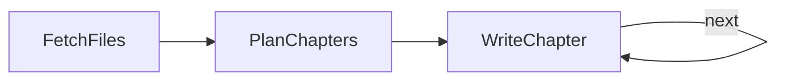

# Design Doc: Codebase Knowledge Builder

> Please DON'T remove notes for AI

## Requirements

> Notes for AI: Keep it simple and clear.
> If the requirements are abstract, write concrete user stories

Point the system at a repository and get back a beginner-friendly tutorial: the ten most important abstractions, ordered so each chapter builds on the previous ones. The key requirement is coherence across chapters — chapter 5 should reference what chapters 1-4 already taught, not re-explain everything from scratch.

## Flow Design

> Notes for AI:
> 1. Consider the design patterns of agent, map-reduce, rag, and workflow. Apply them if they fit.
> 2. Present a concise, high-level description of the workflow.

### Applicable Design Pattern:

**Workflow** with a **context-carrying loop**. Unlike a self-healing loop (which retries failures), this loop accumulates: each WriteChapter iteration reads everything written so far, so later chapters build on earlier ones instead of repeating them.

### Flow high-level Design:

1. **FetchFiles**: Walks the repo and loads every source file into one string.
2. **PlanChapters**: Asks the LLM for the 10 most important abstractions, ordered for a beginner.
3. **WriteChapter**: Writes one chapter per iteration, seeing the plan, the source, and a summary of every chapter already written. Returns "next" to loop until the plan is exhausted.



## Utility Functions

> Notes for AI:
> 1. Understand the utility function definition thoroughly by reviewing the doc.
> 2. Include only the necessary utility functions, based on nodes in the flow.

1. **Call LLM** (`call_llm.py` at the repo root)
   - *Input*: prompt (str)
   - *Output*: response (str)
   - Used by PlanChapters and WriteChapter. File reading is plain `os.walk` inside FetchFiles.

## Node Design

### Shared Store

> Notes for AI: Try to minimize data redundancy

```python
shared = {
    "repo_path": "...",    # Input: directory to document
    "files_text": "...",   # FetchFiles output: all source concatenated
    "chapters": [],        # PlanChapters output: [{"title", "description"}]
    "written": [],         # WriteChapter output: one entry per finished chapter
    "current_idx": 0,      # loop cursor
}
```

### Node Steps

> Notes for AI: Carefully decide whether to use Batch/Async Node/Flow.

1. **FetchFiles** — Regular. *prep*: read "repo_path". *exec*: walk the tree, load `.py`/`.js`/`.ts` files. *post*: write "files_text".
2. **PlanChapters** — Regular. *prep*: read "files_text". *exec*: prompt for a 10-chapter YAML plan. *post*: write "chapters", initialize "written" and "current_idx".
3. **WriteChapter** — Regular. *prep*: read the current chapter spec, the source, and the first 500 characters of every finished chapter (the carried context). *exec*: write the chapter. *post*: append to "written", advance the cursor, return "next" until the plan is exhausted, then None to exit.
