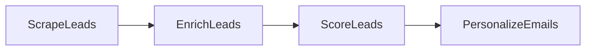

# Lead gen: the LLM only touches two of four stages

Section 6.4. Scrape and enrich are pure API plumbing; the model only scores leads and writes emails for the hot ones (score >= 6). Design in [docs/design.md](docs/design.md).



```bash
python main.py
```

## Sample output

```
Scores:
  Priya Patel: 9/10 — As Head of AI at a mid-sized SaaS company, she has direct budget and high need for efficient LLM frameworks to accelerate product development.
  Sarah Chen: 8/10 — As CTO of a massive public fintech company, she oversees massive technical scaling, though enterprise decision-making cycles may be longer.
  Marcus Johnson: 4/10 — As an Engineering Manager in hardware, his need for an LLM development framework is likely niche compared to software-first companies.

--- Priya Patel (score: 9) ---
Subject: Scaling LLMs at Acme Corp

Priya, as Acme Corp scales its Series B SaaS platform, your engineering team is
likely spending too much time wrestling with complex prompt chaining and latency
issues in production. PocketFlow is a lightweight LLM framework built specifically
to help developers streamline orchestration and ship AI features faster. Do you
have 15 minutes next Tuesday at 10 AM to discuss how we can accelerate your roadmap?
```

Marcus scores below 6, so he gets no email — the hot-lead filter in action.
