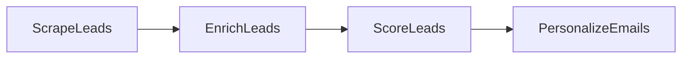

# Design Doc: Lead Generation Pipeline

> Please DON'T remove notes for AI

## Requirements

> Notes for AI: Keep it simple and clear.
> If the requirements are abstract, write concrete user stories

A sales team feeds in raw leads (name, title, company) and gets back a scored, ranked list plus a personalized cold email for every hot lead. Each email must reference something specific about the lead's company — generic blasts are the failure mode this product exists to kill. In production, a human review step belongs before any email actually goes out.

## Flow Design

> Notes for AI:
> 1. Consider the design patterns of agent, map-reduce, rag, and workflow. Apply them if they fit.
> 2. Present a concise, high-level description of the workflow.

### Applicable Design Pattern:

**Workflow** — a four-node chain where the LLM only touches the last two stages. Scraping and enrichment are pure API plumbing; scoring and personalization are where the model earns its keep.

### Flow high-level Design:

1. **ScrapeLeads**: Normalizes name, title, and company from whatever lead source you use (a sample list here; LinkedIn or Apollo in production).
2. **EnrichLeads**: Merges in industry, size, and funding from a company database (a fake dict here; Clearbit or Apollo in production).
3. **ScoreLeads**: One LLM call scores all leads 1-10 with a reason each, then ranks them.
4. **PersonalizeEmails**: One LLM call per hot lead (score >= 6) writes a 3-sentence email referencing the enrichment data.



## Utility Functions

> Notes for AI:
> 1. Understand the utility function definition thoroughly by reviewing the doc.
> 2. Include only the necessary utility functions, based on nodes in the flow.

1. **Call LLM** (`call_llm.py` at the repo root)
   - *Input*: prompt (str)
   - *Output*: response (str)
   - Used by ScoreLeads (one call for all leads) and PersonalizeEmails (one call per hot lead).

## Node Design

### Shared Store

> Notes for AI: Try to minimize data redundancy

```python
shared = {
    "leads": [],    # ScrapeLeads normalizes, EnrichLeads adds enrichment,
                    # ScoreLeads adds score and score_reason, then sorts
    "emails": [],   # PersonalizeEmails output: [{"lead": {...}, "email": "..."}]
}
```

### Node Steps

> Notes for AI: Carefully decide whether to use Batch/Async Node/Flow.

1. **ScrapeLeads** — Regular, no LLM. *prep*: read "leads" or fall back to the sample list. *exec*: keep name/title/company. *post*: write "leads".
2. **EnrichLeads** — Regular, no LLM. *prep*: read "leads". *exec*: merge company data and build a one-line enrichment summary. *post*: write "leads".
3. **ScoreLeads** — Regular. *prep*: read "leads". *exec*: one prompt over all leads, YAML scores back. *post*: attach scores, sort descending.
4. **PersonalizeEmails** — Regular. *prep*: filter leads with score >= 6. *exec*: one email per hot lead, referencing the enrichment. *post*: write "emails".
