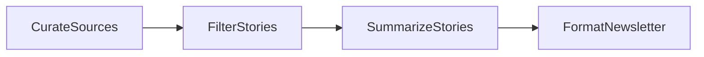

# AI newsletter: curate, filter, summarize, format

Section 6.6. Searches the web per topic, keeps the 4 stories worth reading, writes a blurb each, and assembles the digest — the last node is plain string assembly with no LLM. Design in [docs/design.md](docs/design.md).



```bash
python main.py
```

## Sample output

```
  Curated 3 topic searches
  Selected 4 stories
# AI Weekly Digest

## 1. Ian Paterson's 2026 LLM Benchmark Maps Cost and Performance Across 38 Production Tasks
Stop guessing which model to deploy—this new 38-task benchmark breaks down exact
cost-performance ratios to help you route production traffic smarter and slash API waste.

## 2. Google's A2A Standard and Model Context Protocol Join the Linux Foundation's Agentic AI Foundation
The fragmented AI agent ecosystem just got a massive stability boost as Google and
Anthropic unite their core protocols under neutral, enterprise-backed governance.

## 3. Yann LeCun's Advanced Machine Intelligence Raises $1.03 Billion Seed Round to Build AI World Models
Yann LeCun's new venture just smashed records with a staggering $1.03B seed round,
signaling a massive industry pivot toward physical-world AI reasoning.

## 4. Alibaba Introduces Qwen-UI-Agent to Navigate Real-World Screens and Desktop Software
Alibaba's new Qwen-UI-Agent can natively click, swipe, and navigate across any phone
or desktop app, bringing us one step closer to truly autonomous digital workflows.
```
