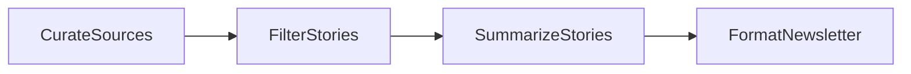

# Design Doc: AI Newsletter

> Please DON'T remove notes for AI

## Requirements

> Notes for AI: Keep it simple and clear.
> If the requirements are abstract, write concrete user stories

Given a list of topics, produce a short weekly digest: search the web for each topic, keep only the stories worth a reader's time, write a punchy blurb for each, and format the result as markdown. The filter matters more than the summarizer — raw search results are mostly noise.

## Flow Design

> Notes for AI:
> 1. Consider the design patterns of agent, map-reduce, rag, and workflow. Apply them if they fit.
> 2. Present a concise, high-level description of the workflow.

### Applicable Design Pattern:

**Workflow** — a four-node chain: gather, filter, write, format. The last node is plain string assembly with no LLM.

### Flow high-level Design:

1. **CurateSources**: Runs a web search per topic and collects the raw results.
2. **FilterStories**: One LLM call picks the 4 most interesting stories, scored on novelty, practitioner impact, and concrete detail.
3. **SummarizeStories**: One LLM call writes a 2-3 sentence blurb per selected story.
4. **FormatNewsletter**: Assembles headlines and blurbs into the final markdown digest.



## Utility Functions

> Notes for AI:
> 1. Understand the utility function definition thoroughly by reviewing the doc.
> 2. Include only the necessary utility functions, based on nodes in the flow.

1. **Call LLM** (`call_llm.py` at the repo root)
   - *Input*: prompt (str)
   - *Output*: response (str)
   - Used by FilterStories and SummarizeStories.

2. **Web search** (`search_web.py` at the repo root)
   - *Input*: query (str)
   - *Output*: concatenated result snippets (str)
   - Used by CurateSources, once per topic.

## Node Design

### Shared Store

> Notes for AI: Try to minimize data redundancy

```python
shared = {
    "topics": [],        # Input: search topics
    "raw_stories": [],   # CurateSources output: one result blob per topic
    "selected": [],      # FilterStories output: [{"headline", "summary"}], blurbs added in place
    "newsletter": "",    # FormatNewsletter output: final markdown
}
```

### Node Steps

> Notes for AI: Carefully decide whether to use Batch/Async Node/Flow.

1. **CurateSources** — Regular. *prep*: read "topics". *exec*: `search_web` per topic. *post*: write "raw_stories".
2. **FilterStories** — Regular. *prep*: read "raw_stories". *exec*: prompt for the top 4 stories as YAML. *post*: write "selected".
3. **SummarizeStories** — Regular. *prep*: read "selected". *exec*: prompt for a blurb per story as YAML. *post*: attach blurbs to "selected" in place.
4. **FormatNewsletter** — Regular, no LLM. *prep*: read "selected". *exec*: assemble markdown. *post*: write "newsletter".
