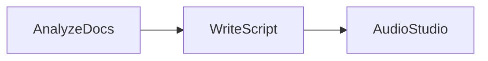

# Design Doc: NotebookLM Podcast Generator

> Please DON'T remove notes for AI

## Requirements

> Notes for AI: Keep it simple and clear.
> If the requirements are abstract, write concrete user stories

A user uploads a stack of documents (reports, research papers, contracts) and gets back a two-host podcast discussing them. The hosts should banter, react, and surface the surprising parts — not read summaries aloud. One prompt can't comprehend the documents, structure a conversation, and stay creative all at once, so the work is split into focused stages.

## Flow Design

> Notes for AI:
> 1. Consider the design patterns of agent, map-reduce, rag, and workflow. Apply them if they fit.
> 2. Present a concise, high-level description of the workflow.

### Applicable Design Pattern:

**Workflow** — a straight three-node chain. Each node has a single focused responsibility, so each prompt does one job well instead of four jobs badly.

### Flow high-level Design:

1. **AnalyzeDocs**: Reads all documents and extracts 2-3 surprising nuggets from each — the "wait, really?" moments a podcast is built on.
2. **WriteScript**: Turns the nuggets into a two-host conversation with interruptions and reactions, returned as structured YAML.
3. **AudioStudio**: Renders each line to audio with the voice matching its speaker, then concatenates the clips.



## Utility Functions

> Notes for AI:
> 1. Understand the utility function definition thoroughly by reviewing the doc.
> 2. Include only the necessary utility functions, based on nodes in the flow.

1. **Call LLM** (`call_llm.py` at the repo root)
   - *Input*: prompt (str)
   - *Output*: response (str)
   - Used by AnalyzeDocs and WriteScript.

2. **Text to Speech** (`utils.py`)
   - *Input*: text (str), voice (str)
   - *Output*: raw PCM audio bytes
   - Used by AudioStudio. Any TTS API works here — the node only iterates lines and concatenates audio.

## Node Design

### Shared Store

> Notes for AI: Try to minimize data redundancy

```python
shared = {
    "documents": [],   # Input: list of document strings
    "nuggets": "",     # AnalyzeDocs output: surprising facts worth discussing
    "script": [],      # WriteScript output: [{"name": "Alex", "line": "..."}]
    "audio": b"",      # AudioStudio output: concatenated PCM bytes
}
```

### Node Steps

> Notes for AI: Carefully decide whether to use Batch/Async Node/Flow.

1. **AnalyzeDocs**
   - *Purpose*: Find the hooks — surprising stats, conflicts, "wait, really?" moments.
   - *Type*: Regular
   - *Steps*:
     - *prep*: Read "documents" from the shared store.
     - *exec*: One prompt over all documents asking for 2-3 nuggets each.
     - *post*: Write "nuggets" to the shared store.

2. **WriteScript**
   - *Purpose*: Turn nuggets into natural two-host banter.
   - *Type*: Regular, `max_retries=3` — the schema asserts crash the node so a malformed script is rewritten, not shipped.
   - *Steps*:
     - *prep*: Read "nuggets".
     - *exec*: Ask for a YAML script; parse and assert every line has a known speaker.
     - *post*: Write "script".

3. **AudioStudio**
   - *Purpose*: Purely mechanical rendering — no content understanding.
   - *Type*: Regular
   - *Steps*:
     - *prep*: Read "script".
     - *exec*: Call `text_to_speech(line, voice)` per line, concatenate the audio.
     - *post*: Write "audio".
