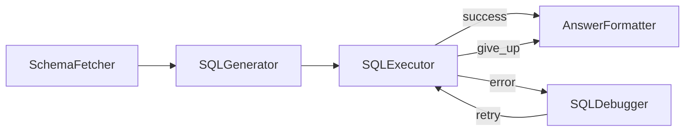

# Text to SQL with a self-healing loop

Section 6.2. English question in, one-sentence answer out — with a debug loop that reads the error message and repairs the SQL, capped at three attempts. Design in [docs/design.md](docs/design.md).



```bash
python main.py   # creates the sample shop.db on every run
```

## Sample output

```
Q: How much revenue came from completed orders?
A: Completed orders generated a total revenue of $389.93.

Q: Which customer spent the most?
A: Dave spent the most money.
```
