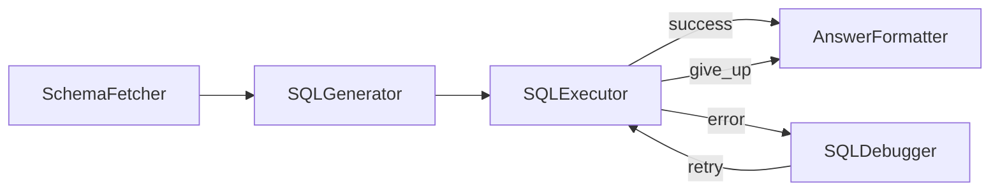

# Design Doc: Text to SQL with a Self-Healing Loop

> Please DON'T remove notes for AI

## Requirements

> Notes for AI: Keep it simple and clear.
> If the requirements are abstract, write concrete user stories

A non-technical user types a question in English ("How much revenue came from completed orders?") and gets back a one-sentence answer computed from a real SQLite database. Generated SQL fails often enough that a retry loop is mandatory: on error, the system should read the error message, fix the query, and try again — up to three repairs — then apologize instead of hanging.

## Flow Design

> Notes for AI:
> 1. Consider the design patterns of agent, map-reduce, rag, and workflow. Apply them if they fit.
> 2. Present a concise, high-level description of the workflow.

### Applicable Design Pattern:

**Workflow** with a **self-healing loop**: a straight chain until execution, then a branch that routes errors back through a debugger. The loop is capped at three repairs so a hopeless query ends in a polite failure, not an infinite loop.

### Flow high-level Design:

1. **SchemaFetcher**: Reads the real table definitions so the LLM never guesses column names.
2. **SQLGenerator**: Turns the question plus schema into a SQLite query.
3. **SQLExecutor**: Runs the query read-only. Success goes to the formatter; an error routes to the debugger; the fourth failure gives up.
4. **SQLDebugger**: Reads the failed SQL and the error message together and writes a fixed query, then loops back to the executor.
5. **AnswerFormatter**: Turns raw rows into one sentence, and owns the apology when the loop gave up.



## Utility Functions

> Notes for AI:
> 1. Understand the utility function definition thoroughly by reviewing the doc.
> 2. Include only the necessary utility functions, based on nodes in the flow.

1. **Call LLM** (`call_llm.py` at the repo root)
   - *Input*: prompt (str)
   - *Output*: response (str)
   - Used by SQLGenerator, SQLDebugger, and AnswerFormatter.

2. **Database fixture** (`utils.py`)
   - `setup_db()` creates the sample `shop.db` (customers and orders). SQLite access inside the nodes uses `sqlite3` directly.

## Node Design

### Shared Store

> Notes for AI: Try to minimize data redundancy

```python
shared = {
    "db_path": "shop.db",     # Input
    "question": "...",        # Input: natural language question
    "schema": "...",          # SchemaFetcher output
    "sql_query": "...",       # SQLGenerator/SQLDebugger output
    "results": [],            # SQLExecutor output on success
    "error_msg": "...",       # SQLExecutor output on failure
    "fix_attempts": 0,        # loop counter, capped at 3 repairs
    "answer": "...",          # AnswerFormatter output
}
```

### Node Steps

> Notes for AI: Carefully decide whether to use Batch/Async Node/Flow.

1. **SchemaFetcher** — Regular. *prep*: read "db_path". *exec*: read `sqlite_master` for table definitions. *post*: write "schema".
2. **SQLGenerator** — Regular. *prep*: read "question" and "schema". *exec*: prompt for SQL only. *post*: strip markdown fences, write "sql_query".
3. **SQLExecutor** — Regular. *prep*: read "db_path" and "sql_query". *exec*: reject non-SELECT, run read-only, return success or error. *post*: on success write "results" and return "success"; on failure bump "fix_attempts" and return "error" (≤3) or "give_up".
4. **SQLDebugger** — Regular. *prep*: read question, schema, failed SQL, error. *exec*: prompt for the fixed SQL. *post*: overwrite "sql_query", return "retry". The debugger only writes the fix; the executor decides whether another attempt is allowed.
5. **AnswerFormatter** — Regular. *prep*: read question, results, error. *exec*: one-sentence answer, or the apology if results are missing. *post*: write "answer".
