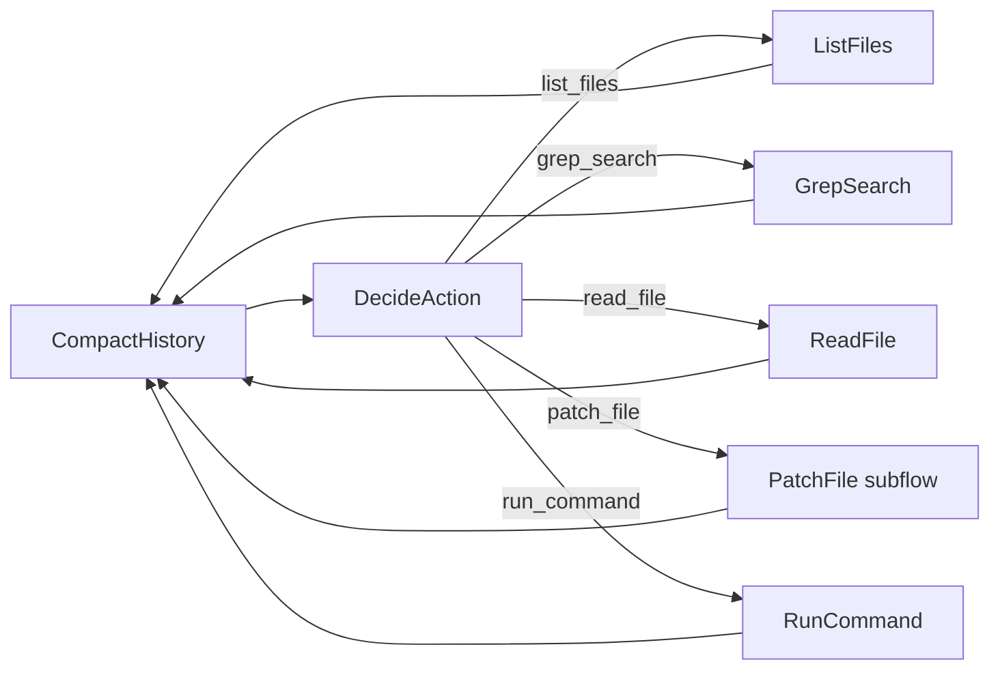
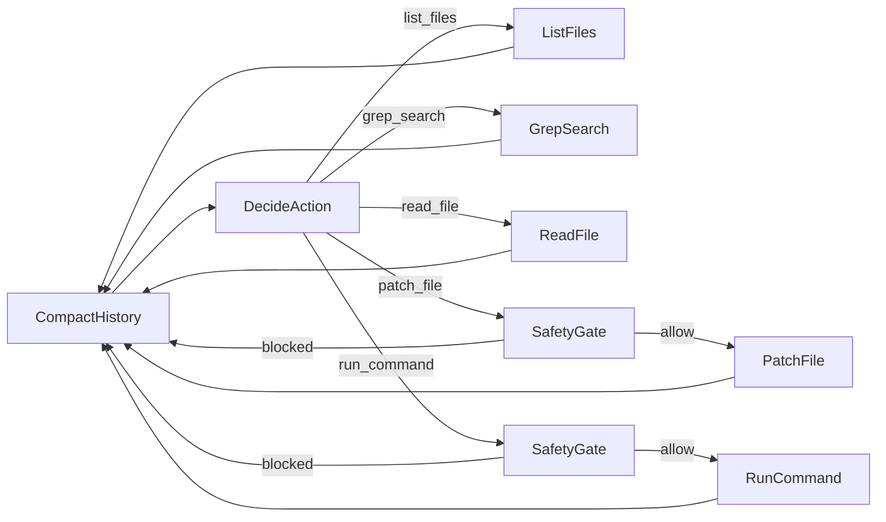

# Chapter 10: Coding Agent

- `coding_agent_naive.py` — Section 10.1: the three-tool loop (read_file, write_file, run_command) that the chapter then dismantles
- `coding_agent.py` — Section 10.1-10.5: One node per tool, patch_file as subflow
- `coding_agent_safety.py` — Section 10.3: SafetyGate wired per tool in the graph
- `coding_agent_twopass.py` — Section 10.4: Two-pass editing (Plan → Edit → Verify) with nested flows
- `setup_test_project.py` — Mini SQL database (CSV-backed) with skeleton code + 103 tests
- `ground_truth.py` — Reference implementations of the three skeleton files, for checking the agent's work rather than feeding it

Features:
- **One node per tool** (10.2): DecideAction returns tool name → graph routes to the right node
- **Tool as subflow** (10.3): `patch_file` is a Flow (Read → Validate → Apply), wired like any node
- **Safety gate** (10.3): dangerous tools go through SafetyGate; safe tools bypass it. Graph IS the policy.
- **Two-pass** (10.4): Plan (read-only) → Edit (write) → Verify. Each phase is a nested Flow.
- **Skills** (10.5): loads `AGENTS.md` from project directory
- **Memory** (10.5): persists learnings to `.memory.md` across sessions
- **Compaction** (9.7): summarizes old history when context grows too long

## Running them

Each variant rebuilds the test project first, so you can run them in any order and compare:

```bash
export GEMINI_API_KEY="your-key"

python ch10-coding-agent/coding_agent_naive.py    # 10.1: watch write_file truncate a file
python ch10-coding-agent/coding_agent.py          # 10.2-10.3: one node per tool, patch_file, safety gate
python ch10-coding-agent/coding_agent_twopass.py  # 10.4: plan → edit → verify
```

Expect a few minutes and a few dollars of tokens per run: these are real agent loops editing real
files and running a real test suite. Watch the printed tool calls rather than the final line, since
the interesting part is which tool the agent reaches for. Chapter 10 reports the two-pass agent
passing all 103 tests in 32 steps where the naive loop never converges; your run will differ in the
step count because the model picks its own path every time, which is the point of 10.3.

## Flow (coding_agent.py)



## Flow (coding_agent_safety.py)



## Test Project: Mini SQL Database (skeleton + tests)

```
test_project/
├── tokenizer.py     — SKELETON: SQL lexer (function signatures + docstrings)
├── parser.py        — SKELETON: SQL parser (function signatures + docstrings)
├── executor.py      — SKELETON: query executor (function signatures + docstrings)
├── database.py      — Provided: CSV loader with type casting
├── query.py         — Provided: main entry point
├── employees.csv    — 10 employees, 3 departments
├── departments.csv  — 3 departments with budgets
├── projects.csv     — 5 projects with leads
├── test_tokenizer.py — 19 unit tests for tokenizer
├── test_parser.py    — 22 unit tests for parser
├── test_executor.py  — 21 unit tests for executor
├── test_sql.py       — 41 end-to-end integration tests
└── AGENTS.md         — Project rules
```

Task: implement all skeleton functions to make 103 tests pass.
